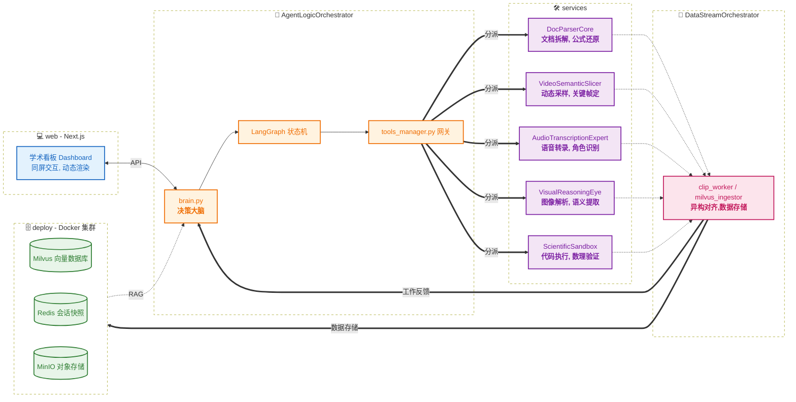

## 项目提案

> Multi-Modal Academic Agent

### 核心创意

> 核心竞争力:资源解析的细腻度,交互式答疑的引导性

开发一个集"文档深度解析,视频要点提取,交互式答疑"于一体的智能助手

---

### 难点分析

> 难度评估:中等偏上,利用现有开源模型可以实现

#### 文档解析

* **布局预测**:将文档识别为"标题/段落/公式/图标"等块状结构,保持逻辑顺序
* **公式还原**:针对数理公式,转换成LaTex代码,让AI精准读取
* **多层次索引**:建立"页-段落-实体"的三层索引结构,使学生提问时让智能体能够精准定位

#### 视频解析

* **关键帧-文本桥接**:利用`CLIP`模型进行视觉语义嵌入,将视频中的关键帧于`Whisper`生成的音频文本在向量空间对齐
* **动态滑窗采样**:不固定帧率采样,识别视频中的"画面突变"来捕捉切换点
* **语义打桩**:利用`Qwen2-VL`生成结构化大纲,当学生点击总结的某一要点时可以定位到视频的相应时间段

#### 交互式答疑

* **思维链剪枝**:在Agent内部进行全量的思维链推理,但通过Post-processing只展示精炼后的关键点
* **外部检验**:针对数学/计算机问题,接入`Python Interpreter/SymPy`,实现"学生提问->AI生成代码验证公式/算法->验证无误后简练文字回答"

---

### 基础方案

#### 数据中枢

> 将非结构化的学习资源转化为AI可索引可理解的结构化知识

##### 文档解析

* **pdf->markdown**:引入`MinerU`将PDF转换为带有标准LaTex的markdown文档
* **块状化处理**:使用`LayoutLMv3`进行语义切片,使用`DINOv2`进行图片特征提取

##### 视频解析

* **音频解析**:使用`Whisper-v3`进行语音转录,(利用`Pyannote.audio`进行说话人日志处理)
* **视觉路径**:使用`OpenCV`计算帧差,仅在屏幕内容显著变化时截取关键帧
* **跨模态索引**:使用`CLIP`将视觉关键帧内容与语音文本拼接成Embedding,实现搜重点定位视频片段
* **结构化大纲**:使用`Qwen2-VL`生成结构化大纲,实现语义聚合/标题提取/锚点固定

##### 存储与检索

* **结构化数据存储**:使用`Milvus`存储文档片段和视频关键帧的Embedding,支持多模态混合检索

#### 模型架构

> 调配不同模型确保长文本理解与逻辑推导的准确

##### 双模型调度

* **大脑**:选用`DeepSeek-V3`,负责高难度的数理逻辑推理,代码生成和对话管理
* **眼睛**:集成`Qwen2-VL`,专门用于解析手写草稿/复杂函数图像/视频中的演示

##### 交互式答疑

* **状态控制**:引入`LangGraph`管理对话状态,维护会话记忆,确保回答依照"结论->推导->拓展"进行
* **数学验证工具**:涉及计算机算法或复杂计算时,Agent自动调用Python解释器计算中间结果

#### 交互设计

> 界面设计减少干扰,专注内容呈现

##### 渲染界面

* **前端框架**:使用`Next.js`构建灵活侧边栏布局,左侧为文档/视频,右侧为答疑对话框
* **动态数学公式**:集成`MathJax`,支持实时书写公式,支持点击公式查看推导来源

##### 交互功能

* **划词提问**:基于`PDF.js`定位PDF中划选部分,基于上下文进行重点解释
* **视频大纲**:根据视频结构自动生成带时间戳跳转的知识点目录,基于`Video.js`支持点击目录跳转关键段落
* **知识图谱**:使用`D3.js`在`LangGraph`驱动下实时绘制知识图谱

---

## 项目结构

### 环境配置

> 组建一个"专家委员会"

#### "专家委员会"全景图

> 6个Conda工具环境+1个Docker存储集群

- **DocParserCore**: 拆解PDF 
- **VideoSemanticSlicer**: 拆解视频 
- **AudioTranscriptionExpert**: 转录音频 
- **VisualReasoningEye**: 看图说话 
- **ScientificSandbox**: 数学和代码验证 
- **DataStreamOrchestrator**: 调度数据 
- **AgentLogicOrchestrator**: 指挥协作

---

#### "专家"详解

##### **DocParserCore** (文档解析工具)

- 定位: 纯粹的非结构化文档处理
- 核心组件: `MinerU`
- 跨项目复用: 将PDF转为标准(带LaTeX公式)Markdown的场景

##### **VideoSemanticSlicer** (视频语义切片工具)

- 定位: 负责视频关键帧定位
- 核心组件: `OpenCV`
- 跨项目复用: 视频检索、自动剪辑、长视频监控摘要

##### **AudioTranscriptionExpert** (语音转写专家)

- 定位: 负责音频转文本及说话人识别
- 核心组件: `Whisper-v3`, (`Pyannote.audio`)
- 跨项目复用: 会议记录自动生成、播客内容索引、多语言翻译

##### **VisualReasoningEye** (多模态视觉推理工具)

- 定位: 解析复杂图表、手写公式和视频关键帧语义
- 核心组件: `Qwen2-VL`
- 跨项目复用: 图像问答、工业质检场景、自动化GUI测试

##### **ScientificSandbox** (科学计算与验证沙盒)

- 定位:  Agent 的外部检验工具,负责运行 Python 代码和数学公式推导
- 核心组件: `SymPy`, `NumPy`, `Pandas`, `Matplotlib`
- 跨项目复用: 数据分析自动化、数学建模、量化计算验证

##### **DataStreamOrchestrator** (数据调度工具)
跨项目复用: 所有基于大模型的复杂多步骤任务流程控制
- 定位: 负责将解析后的Markdown、视频元数据和向量Embedding写入数据库,并提供检索服务
- 核心组件: `pymilvus`, `redis-py`, `CLIP`, `minio`
- 跨项目复用: 所有涉及向量检索(RAG)和元数据管理的项目

##### **AgentLogicOrchestrator** (逻辑编排大脑)

- 定位: 负责思维链(CoT)推理、状态机维护和工具调用逻辑
- 核心组件: `LangGraph`, `DeepSeek-V3-SDK`
- 跨项目复用: 所有基于大模型的复杂多步骤任务流程控制

---


### 项目目录

#### 项目目录结构
```Plaintext
AcademicAgent-Suite/
├── configs/                # 配置文件中心
│   ├── milvus_config.yaml  
│   ├── model_config.yaml   
│   ├── video_config.yaml   
│   └── magic-PDF.json    
│
├── deploy/                 # 部署与基础设施
│   └── docker-compose.yml  
│
├── models/                   # 模型资产中心
│   ├── miner_u/              
│   ├── dinov2/              
│   ├── whisper_v3/              
│   ├── qwen2_vl/             
│   └── clip/                 
│
├── core/                   # 核心逻辑 (AgentLogicOrchestrator 环境运行)
│   ├── brain.py            # LangGraph 状态机实现
│   ├── prompts/            # 系统级提示词 (CoT 模板)
│   └── tools_manager.py    # 跨环境调用网关 (Subprocess 管理器)
│
├── services/               # 环境化工具脚本
│   ├── doc_parser/         # (DocParserCore 运行)
│   │   ├── miner_worker.sh 
│   │   └── pdf_wrapper.py 
│   ├── video_vision/       # (VideoSemanticSlicer 运行)
│   │   ├── video_slicer.py
│   │   └── video_wrapper.py 
│   ├── audio_pro/          # (AudioTranscriptionExpert 运行)
│   │   ├── whisper_node.py
│   │   └── audio_wrapper.py 
│   ├── reasoning_eye/      # (VisualReasoningEye 运行)
│   │   ├── qwen_inference.py
│   │   └── visual_wrapper.py 
│   └── sandbox/            # (ScientificSandbox 运行)
│        ├── executor_logic.py
│        └── sandbox_wrapper.py 
│
├── data_layer/             # 数据调度 (DataStreamOrchestrator 运行)
│   ├── clip_worker_pdf.py    
│   ├── clip_worker_video.py    
│   └── milvus_ingestor.py   
│
├── logs/                    # 日志中心
│   ├── doc_parser_log.txt         
│   ├── video_vision_log.txt 
│   ├── audio_pro_log.txt 
│   ├── reasoning_eye_log.txt 
│   └── sandbox_log.txt            
│
├── web/                    # 前端交互 (Next.js 框架)
│   ├── components/         # 侧边栏、PDF 渲染器、视频播放器
│   └── api/                # 后端路由,连接 core/brain.py
│
├── storage/                # 本地挂载点 (不进入 Git 版本控制)
│   ├── raw_files/          # 原始上传的 PDF/视频
│   ├── processed/          # 解析后的 Markdown/关键帧图片
│   └── db_data/            # Docker 容器持久化数据路径
│
└── requirements/           # 导出各环境的依赖清单
    ├── DocParserCore.yml
    └── AgentLogicOrchestrator.yml
    └── ...
```


#### 核心组件说明

##### **configs/** 全局参数中枢
- **职能**: 集中管理所有敏感信息和静态配置,避免硬编码
- **说明**:
  - milvus_config.yaml: 向量检索的维度、索引类型和集合名称等配置
  - model_config.yaml: 存储 `API Key`、模型本地权重路径,以及各 `Conda` 环境的 `Python` 解释器绝对路径
  - video_config.yaml: 滑动窗口切片关键帧相关配置
  - magic-PDF.json: `minerU` 的配置

##### **deploy/** 基础设施底座
- **职能**: 通过 `Docker` 提供数据库和对象存储服务
- **说明**: 
  - Etcd: 元数据中心,负责 Milvus 的集合结构、索引状态及数据存储路径映射的强一致性管理
  - Milvus: 向量数据库,负责文档和视频关键帧语义的索引
  - Redis: 缓存层,用于存储 `LangGraph` 的会话状态(Checkpoints),支持断点续传式的交互
  - MinIO: 兼容 `S3` 协议的对象存储,管理大规模原始视频和图片文件

##### **models/** 统一模型资产池
- **职能**: 作为全项目唯一的、跨环境共享的只读模型存储中心
- **说明**: 
  - 环境复用: 不同 `Conda` 环境可能都会用到 `CLIP` 或相似的视觉底座
  - 矿工模式支持: 针对 `MinerU` 这种对模型存放路径有严格要求的工具,可以在其启动脚本中通过软链接保持资产池的整洁
  - 运维便利: 在 `Linux` 上部署时,只需通过 `scp` 或 `rsync` 维护这一个文件夹即可完成所有模型的迁移。

##### **core/** 大脑与决策中心 (AgentLogicOrchestrator)
- **职能**: 负责逻辑推理、思维链生成及跨环境的任务分派
- **说明**: 
  - brain.py: 使用 LangGraph 构建的状态机,管理从"理解提问"到"输出结论"的整个流程
  - tools_manager.py: 项目的"网关",封装了 `subprocess` 逻辑,允许大脑在不离开当前环境的情况下,调用其他 `Conda` 环境中的 `Python` 脚本并捕获其返回结果

##### **services/** 执行层专家库 (各专项 Conda 环境)
- **职能**: 完成特定的模态解析任务,每个子目录代表一个独立的工具化环境
- **说明**: 
  - doc_parser/: 利用 `MinerU` 或 `LayoutLM` 解决布局预测与公式还原
  - video_vision/: 负责动态滑窗采样,将视频切分为语义对齐的关键帧序列
  - audio_pro/: 使用 `Whisper-v3` 进行语音识别,并区分说话人
  - reasoning_eye/: 解析视频大纲、数学函数或图表
  - sandbox/: 纯净的 `ScientificSandbox` 环境,用于运行 `Agent` 生成的 `Python` 代码,通过物理执行结果验证逻辑

##### **data_layer/** 数据屏蔽层 (DataStreamOrchestrator)
- **职能**: 负责异构数据的持久化与检索逻辑,是"业务"与"存储"的中间层
- **说明**: 
  - clip_worker_pdf.py: 对 `PDF` 解析做向量化等处理
  - clip_worker_video.py: 对视频解析做向量化等处理
  - milvus_ingestor.py: 将已处理数据存入 `Milvus` 


##### **web/** 人机交互门户 (Next.js)
- **职能**: 提供 "scannable"的侧边栏布局,实现文档与答疑的同屏交互
- **说明**: 
  - components/: 构建响应式、可交互的学术阅读与视频学习界面
  - api/: 作为 `Next.js` 服务端逻辑层,负责接收前端请求并与核心 Agent 环境进行通信

##### **storage/** 多模态流转中心
- **职能**: 作为各 `Conda` 环境之间的数据交互总线
- **说明**: 
  - raw_files/: 暂存区,保留原始学习资源
  - processed/: 结果区,存放 PDF 拆解后的文本块、提取的 LaTeX 图片、视频切片和语音转录文本
  - db_data/: 宿主机挂载点,储存 Docker 容器数据库内容

---

### 项目架构图



---

## 项目实现

### 基础设施与环境搭建

> 打通底座,确保“专家委员会”就位

#### 硬件与存储准备

- 部署 `Docker` 容器,确保本地挂载路径 `storage/db_data` 正确映射
```bash
# 下载密钥
curl -fsSL https://mirrors.tuna.tsinghua.edu.cn/docker-ce/linux/ubuntu/gpg | sudo gpg --dearmor -o /etc/apt/keyrings/docker.gpg

# 添加清华源
echo "deb [arch=$(dpkg --print-architecture) signed-by=/etc/apt/keyrings/docker.gpg] https://mirrors.tuna.tsinghua.edu.cn/docker-ce/linux/ubuntu $(lsb_release -cs) stable" | sudo tee /etc/apt/sources.list.d/docker.list > /dev/null
sudo apt update

# 安装docker及相关工具
sudo apt-get install docker-ce docker-ce-cli containerd.io docker-compose-plugin -y

# 优化docker核心配置
sudo mkdir -p /etc/docker
sudo tee /etc/docker/daemon.json <<-'EOF'
{
  "registry-mirrors": [
    "https://docker.m.daocloud.io"
  ]
}
EOF
sudo systemctl restart docker

# 创键docker挂载配置文件
nano deploy/docker-compose.yaml
    #---具体配置略去---

# 部署
cd deploy
sudo docker compose up -d
```

- 创建 `models/` 统一资产池,提前下载模型权重。
```bash
# 任意挑选一个环境
pip install modelscope
# 下载模型权重
cd models/
python -c "from modelscope import snapshot_download; snapshot_download('AI-ModelScope/clip-vit-large-patch14', local_dir='./clip')"
python -c "from modelscope import snapshot_download; snapshot_download('Systran/faster-whisper-large-v3', local_dir='./whisper_v3')"
python -c "from modelscope import snapshot_download; snapshot_download('qwen/Qwen2-VL-7B-Instruct', local_dir='./qwen2_vl')"
python -c "from modelscope import snapshot_download; snapshot_download('opendatalab/PDF-Extract-Kit-1.0', local_dir='./miner_u')"
# meneru该模型权重版本与magic-pdf有一定差别
cd mener_u/models
## 调整Layout
mv Layout/LayoutLMv3/config.json Layout
mv Layout/LayoutLMv3/model_final.pth Layout
rm -r Layout/LayoutLMv3/
## 调整MFD
mv MFD/YOLO/yolo_v8_ft.pt MFD/weights.pt
rm -r MFD/YOLO/
# 未在魔搭上找到dinov2模型权重
mkdir dinov2 | cd dinov2
curl -L -O https://dl.fbaipublicfiles.com/dinov2/dinov2_vitl14/dinov2_vitl14_pretrain.pth
```

#### 环境隔离与依赖安装

- 依照项目 `requierements/环境名.yml` ,依次创建7个 `Conda` 环境
```bash
conda env create -f 环境名.yml
```

#### 写全局配置

- 完善 `configs/model_config.yaml`,填入各环境 `Python` 解释器的绝对路径

--- 

### 数据解析服务

> 让每个“专家”都能独立工作并产生结构化输出。

##### 文档解析模块 (DocParserCore)

1. `PDF` 识别
- 创建 `configs/magic-pdf.json` 配置 `magic-pdf`
<!-->
原计划使用python脚本调用magic-pdf底层函数实现识别,但接口由于版本匹配难度较大,最终直接使用shell脚本调用内置命令行工具
<!-->
- 创建 `services/doc_parser/mineru_worker.sh` 实现 `PDF` 识别,结果存入 `storage/process/magic-pdf/`

##### 视频解析模块 (VideoSemanticSlicer/AudioTranscriptionExpert)

1. 视频语义切片
- 创建 `configs/video_config.yaml` 配置切片参数
- 创建 `services/video_vison/video_slicer.py` 实现视频转码/切片(若长期静默画面则按时间切分),结果存入 `storage/process/video/`

2. 音频转文本
- 创建 `services/audio_pro/whisper_node.py` 实现视频音频句级文本化,结果存入 `storage/processed/video/视频名/transcript.json`

##### 沙盒验证模块 (ScientificSandbox)

1. 问题验证
- 创建 `services/sandbox/executor_logic.py` 实现对数值计算/符号求解的验证

##### 视觉推理模块 (VisualReasoningEye)

1. 视觉推理
- 创建 `services/reasoning_eye/qwen_inference.py` 实现视觉推理本地化

##### 数据调度模块 (DataStreamOrchestrator)

1. 数据处理
- 创建 `data_layer/clip_worker_pdf.py` 实现pdf文本和图表向量化,结果存入 `storage/process/magic-pdf/文件名/multimodal_features.json`
- 创建 `data_layer/clip_worker_pdf.py` 实现视频切片与语音文本对齐并向量化,结果存入 `storage/processed/video/视频名/alignment_metadata.json`

2. 数据存储
- 创建 `configs/milvus_config.yaml` 配置 `Milvus`
- 创建 `data_layer/milvus_ingestor.py` 将 `multimodal_features.json` 和 `alignment_metadata.json` 存入 `Milvus`,将图片存入 `Minio`

3. 数据检索
 --- 待完成 ---

--- 

### Agent 逻辑编排

---待修改---

> 实现逻辑闭环,让 Agent 学会思考和调用工具。

#### 跨环境网关开发：

在 core/tools_manager.py 中实现基于 subprocess 的调用逻辑,封装统一的输入输出接口。

#### 状态机构建 (LangGraph)：

设计 brain.py 逻辑：提问理解 -> 检索策略选择 -> 多模态召回 -> 结果整合。

#### 验证沙盒集成：

接入 ScientificSandbox,实现“思维链生成代码 -> 执行 -> 修正反馈”的闭环,解决幻觉问题。

#### 思维链剪枝：

编写 Post-processing 逻辑,确保输出给用户的是精炼的“结论->推导->拓展”结构。

--- 

### 前端交互与联调

---待修改---

> 将底层能力通过 Web 界面优雅地呈现。

#### 核心看板开发：

使用 Next.js 实现左右分屏：左侧集成 PDF.js 和 Video.js,右侧为对话流。

#### 深度交互功能：

划词提问：捕获 PDF 坐标信息并传递给 Agent。

视频大纲跳转：利用 Qwen2-VL 生成的带时间戳大纲,实现点击跳转关键帧。

#### 渲染优化：

配置 MathJax 渲染 Markdown 中的 LaTeX 公式。

使用 D3.js 实时可视化 LangGraph 的思考路径(知识图谱)。