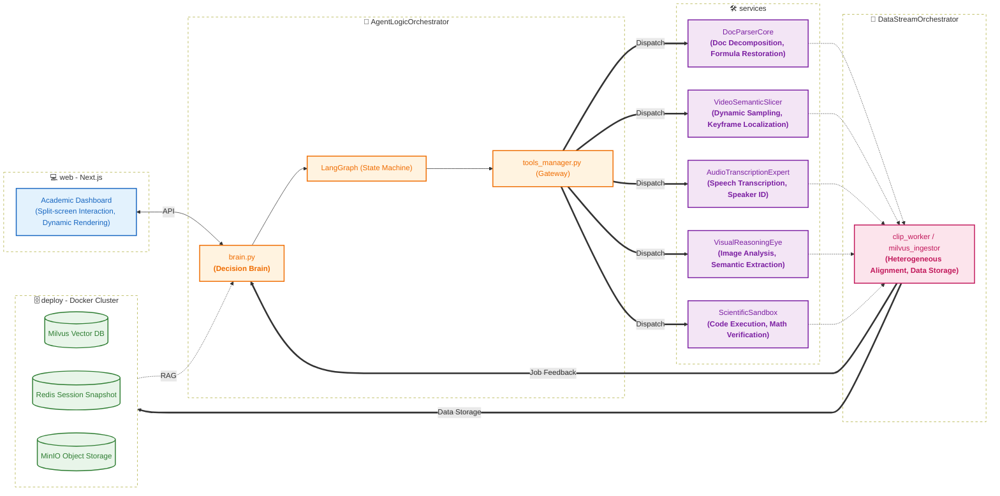

## PROPOSAL

> Multi-Modal Academic Agent

### Core Concept

> Core Competitiveness: Granularity of resourcr parsing and guided interactive Q&A.

Develop an intelligent assistant that integrates "Deep Document Analysis, Video Keypoint Extraction, and Interactive Q&A."

---

### Difficulty Analysis

> Assessment: Medium-High. Achievable using existing open-source models.

#### Document Parsing

* **Layout Prediction**: Recongnize documents as block structures (Titles, Paragraphs, Formulas, Charts) to maintain logical flow.
* **Formula Restoration**: Convert mathematical formulas into LaTeX code for precise AI reading.
* **Multi-level Indexing**: Establish a "Page-Paragraph-Entity" three-tier index structure, allowing the Agent to pinpoint locations.

#### Video Parsing

* **Keyframe-Text Bridging**: Align video keyframes with audio text in a vector space.
* **Dynamic Sliding Window Sampling**: Use variable frame rate sampling to identify "vsiaul mutations" and capture scene transitions.
* **Semantic Anchoring**: Generate structured outlines with clickable timestamps for video navigation.

#### Interative Q&A

* **CoT Pruning**: Perform full CoT reasoning within the Agent, but display only refined key points via post-processing.
* **External Verification**: For math/CS problems, achieve a "Studuent Query -> AI Code Verification -> Concise Answer" workflow.

---

### Basic Solution

#### Data Hub

> Transform unstractured learning resources into AI-indexable structured knowledge.

##### Document Paersing

* **PDF to Markdown**: Integrate `MinerU` to convert PDF files into Markdown documents containing standard LaTeX.
* **Block Processing**: Utilize `LayoutLMv3` for semantic slicing.

##### Video Parsing

* **Audio Analysis**: Use `Whisper-v3` for speech transcription (Use `Pyannote.audio` for speaker diarization).
* **Visual Path**: Use `OpenCV` to calculate frame differences, capturing keyframes only when screen content changes significantly.
* **Cross-Modal Indexing**: Use `CLIP` to concatenate visual keyframe content with audio text into Embeddings, enabling focal point search to locate specific video segments.
* **Structured Outline**: Use `Qwen2-VL` to generate structured outlines, achieving semantic aggregation, title extraction, and another point fixation.

##### Storage and Retrieval

* **Structured Data Storage**: Use `Milvus` to store Embeddings of document fragments and video keyframes, supporting multi-modal hybrid retrieval.

#### Modal Archtecture

> Coordinating different models to ensure accurate long-text understanding and logical reasoning.

##### Dual-Model Dispatching

* **The Brain**: Select `DeepSeek-V3` to handle high-difficulty mathematical logic reasoning, code generation, and dialogue management.
* **The Eyes**: Integrate `Qwen2-VL`, specialized in parsing handwritten drafts, complex function graphs, and video demonstrations.

##### Interactive Q&A

* **State Control**: Introduce `LangGraph` to manage dialogue states and maintain session memory, ensuring answers follow a "Conclusion -> Derivation -> Expansion" structure.
* **Mathematical Verification Tools**: When involving computer algorithms or complex calculations, the Agent automatically calls a Python interpreter calculate intermediate results.

#### Interaction Dessign

> Interface design focused on reducing distractions and prioritizing content presentation.

##### Rendering Interface

* **Frontend Framework**: Use `Next.js` to build a flexible sidebar layout, with documents/videos on the left and the Q&A dialogue box on the right.
* **Dynamic Mathematical Formulas**: Integrate `MathJax` to support real-time formula rendering and clicking on formulas to view their derivation sources.

##### Interactive Features

* **Highlight-to-Ask**: Use `PDF.js` to locate selected parts within the PDF and provide key explanations based on context.
* **Video Outline**: Automatically generate a knowledge point directory with timestamp jumps based on the video structure; use `Video.js` to support clicking the directory to jump to key segments.
* **Knowledge Graph**: Use `D3.js` to render real-time knowledge graphs driven by `LangGraph`.

---

## STRUCTURE

### Environment Configuration

> Assemble a "Committee of Experts".

#### Overview of the "Committee of Experts"

> 6 Conda Tool Environments and 1 Docker Storage Cluster

- **DocParserCore**
- **VideoSemanticSlicer**
- **AudioTranscriptionExpert**
- **VisualReasoningEye**
- **ScientificSandbox**
- **DataStreamOrchestrator**
- **AgentLogicOrchestrator**

---

#### Detailed "Expert" Descriptions

##### **DocParserCore** 

- **Positioning**: Purely for unstructured document processing.
- **Core Component**: `MinerU`
- **Cross-project Reuse**: Scenarios involving converting PDF to standard Markdown (with LaTeX formulas).

##### **VideoSemanticSlicer** 

- **Positioning**: Responsible for video keyframe localization.
- **Core Component**: `OpenCV`
- **Cross-project Reuse**: Video retrieval, automated editing, long-video surveillance summaries.

##### **AudioTranscriptionExpert** 

- **Positioning**: Responsible for audio-to-text conversion (and speaker diarization).
- **Core Component**: `Whisper-v3`, (`Pyannote.audio`)
- **Cross-project Reuse**: Automated meeting minutes, podcast content indexing, multi-language translation.

##### **VisualReasoningEye** 

- **Positioning**: Parses complex charts, handwritten formulas, and video keyframe semantics.
- **Core Component**: `Qwen2-VL`
- **Cross-project Reuse**: Visual Q&A, industrial quality inspection scenarios, automated GUI testing.

##### **ScientificSandbox**

- **Positioning**: External validation tool for the Agent, responsible for running Python code and mathematical formula derivation.
- **Core Component**: `SymPy`, `NumPy`, `Pandas`, `Matplotlib`
- **Cross-project Reuse**: Data analysis automation, mathematical modeling, quantitative calculation verification.

##### **DataStreamOrchestrator** 

- **Positioning**: Responsible for writing parsed Markdown, video metadata, and vector Embeddings into the database, and providing retrieval services.
- **Core Component**: `pymilvus`, `redis-py`, `CLIP`, `minio`
- **Cross-project Reuse**: Projects involving Vector Retrieval and metadata management.

##### **AgentLogicOrchestrator** 

- **Positioning**: Responsible for Chain-of-Thought reasoning, state machine maintenance, and tool-calling logic.
- **Core Component**: `LangGraph`, `DeepSeek-V3-SDK`
- **Cross-project Reuse**: Complex multi-step task flow control based on LLMs.
---


### Dirctory

#### Directory Structure
```Plaintext
AcademicAgent-Suite/
├── configs/                # Centralized Configuration
│   ├── milvus_config.yaml  
│   ├── model_config.yaml   
│   ├── video_config.yaml   
│   └── magic-PDF.json    
│
├── deploy/                 # Deployment & Infrastructure
│   └── docker-compose.yml  
│
├── models/                   # Unified Model Asset Center
│   ├── miner_u/              
│   ├── dinov2/              
│   ├── whisper_v3/              
│   ├── qwen2_vl/             
│   └── clip/                 
│
├── core/                   # Core Logic (Runs in AgentLogicOrchestrator env)
│   ├── brain.py            
│   ├── prompts/            
│   └── tools_manager.py    
│
├── services/               # Environment-specific services scripts
│   ├── doc_parser/         # (Runs in DocParserCore)
│   │   ├── miner_worker.sh 
│   │   └── pdf_wrapper.py 
│   ├── video_vision/       # (Runs in VideoSemanticSlicer)
│   │   ├── video_slicer.py
│   │   └── video_wrapper.py 
│   ├── audio_pro/          # (Runs in AudioTranscriptionExpert)
│   │   ├── whisper_node.py
│   │   └── audio_wrapper.py 
│   ├── reasoning_eye/      # (Runs in VisualReasoningEye)
│   │   ├── qwen_inference.py
│   │   └── visual_wrapper.py 
│   └── sandbox/            # (Runs in ScientificSandbox)
│        ├── executor_logic.py
│        └── sandbox_wrapper.py 
│
├── data_layer/             # Data Scheduling (Runs in DataStreamOrchestrator)
│   ├── clip_worker_pdf.py    
│   ├── clip_worker_video.py    
│   └── milvus_ingestor.py   
│
├── logs/                    # Log Center
│   ├── doc_parser_log.txt         
│   ├── video_vision_log.txt 
│   ├── audio_pro_log.txt 
│   ├── reasoning_eye_log.txt 
│   └── sandbox_log.txt            
│
├── web/                    # Frontend Interaction (Next.js framework)
│   ├── components/         
│   └── api/                
│
├── storage/                # Local Mount Points
│   ├── raw_files/          
│   ├── processed/          
│   └── db_data/            
│
└── requirements/           # Dependency manifests for each environment
    ├── DocParserCore.yml
    └── AgentLogicOrchestrator.yml
    └── ...
```


#### Core Folders/Files Descriptions

##### **configs/** Global Parameter Hub
- **Function**: Centralized management of all sensitive information and static configurations to avoid hardcoding.
- **Details**:
  - milvus_config.yaml: Configurations for vector retrieval dimensions, index types, collection names, etc.
  - model_config.yaml: Stores `API Key`, local model weight paths, and absolute paths for `Python` interpreters in each `Conda` environment.
  - video_config.yaml: Configurations related to dynamic sliding window keyframe slcing.
  - magic-PDF.json: Configuration for `minerU`. 

##### **deploy/** Infrastructure Foundation
- **Function**: Provides database and object storage services via `Docker`.
- **Details**: 
  - Etcd: Metadata center, responsible for strong consistency management of `Milvus` collection structrues, index status, and data storage path mappings.
  - Milvus: Vector database, responsible for indexing the semantics of document fragments and video keyframes.
  - Redis: Caching layer, used to store `LangGraph` session states (checkpoints), supporting breakpoint-resume style interactions.
  - MinIO: `S3`-compatible object storage for managing large-scale raw video and image files.

##### **models/** Model Asset Pool
- **Function**: Serves as the project's singular, cross-environment shared read-only model storage center.
- **Details**: 
  - Environment Reuse: Different `Conda` environments can utilize the same `CLIP` or similar visual backbones.
  - O&M Convenience: When deploying on `Linux`, only this single folder needs to be maintained via `scp` or `rsync` to complete the migration of all models.

##### **core/** Brain & Decision Center (AgentLogicOrchestrator)
- **Function**: Responsible for logical reasoning, Chain-of-Thought generation, and cross-environment task dispatching.
- **Details**: 
  - brain.py: A state machine built with `LangGraph`, managing the entire process from "understanding questions" to "outputting conclusions."
  - tools_manager.py: The project's "gateway," encapsulating `subprocess` logic to allow the Brain to invoke `Python` scripts in other `Conda` environments and capture their return results without leaving its own environment.

##### **services/** Execution Layer Services Library
- **Function**: Completes specific modal tasks, with each subdirectory representing an independent tool-based environment.
- **Details**: 
  - doc_parser/: Utilizes `MinerU` or `LayoutLM` to handle layout prediction and formula restoration.
  - video_vision/: Responsible for dynamic sliding window sampling, slicing videos into semantically aligned keyframe sequences.
  - audio_pro/: Uses `Whisper-v3` for speech recognition (and speaker diarization).
  - reasoning_eye/: Parses video outlines, mathematical functions, or charts.
  - sandbox/: Run Agent-generated `Python` code, verifying logic through physical execution results.

##### **data_layer/** Data Abstraction Layer (DataStreamOrchestrator)
- **Function**: Responsible for the persistence and retrieval logic of heterogeneous data, acting as the intermediate layer between "business" and "storage".
- **Details**: 
  - clip_worker_pdf.py: Handles vectorization and processing for PDF parsing.
  - clip_worker_video.py: Handles vectorization and processing for video parsing.
  - milvus_ingestor.py: Ingests processed data into `Milvus`. 


##### **web/** Human-Computer Interaction Portal (Next.js)
- **Function**: Provides a "scannable" sidebar layout to achieve simultaneous interaction between documents and Q&A.
- **Details**: 
  - components/: Builds responsive, interactive interfaces for academic reading and video learning.
  - api/: Acts as the `Next.js` server-side logic layer, responsible for receiving frontend requests and communicating with the core Agent environment.

##### **storage/** Multi-modal Data Bus
- **Function**: Acts as the data interaction bus between various `Conda` environments.
- **Details**: 
  - raw_files/: Staging area, retaining original uploaded learning resources.
  - processed/: Result area, storing text blocks from PDF decomposition, extracted LaTeX images, video slices, and audio transcription text.
  - db_data/: Host mount point, storing the database content for `Docker` containers.

---

### Architecture Diagram



---

## Implementation

### Infrastructure & Environment Setup

> Establishing the foundation to ensure the "Committee of Experts" is in place.

#### Container & Storage Preparation

- Deploy `Docker` containers and ensure the local mount path `storage/db_data` is correctly mapped.
```bash
# Download GPG key
curl -fsSL https://mirrors.tuna.tsinghua.edu.cn/docker-ce/linux/ubuntu/gpg | sudo gpg --dearmor -o /etc/apt/keyrings/docker.gpg

# Add Tsinghua mirror source
echo "deb [arch=$(dpkg --print-architecture) signed-by=/etc/apt/keyrings/docker.gpg] https://mirrors.tuna.tsinghua.edu.cn/docker-ce/linux/ubuntu $(lsb_release -cs) stable" | sudo tee /etc/apt/sources.list.d/docker.list > /dev/null
sudo apt update

# Install Docker and related tools
sudo apt-get install docker-ce docker-ce-cli containerd.io docker-compose-plugin -y

# Optimize Docker core configuration
sudo mkdir -p /etc/docker
sudo tee /etc/docker/daemon.json <<-'EOF'
{
  "registry-mirrors": [
    "https://docker.m.daocloud.io"
  ]
}
EOF
sudo systemctl restart docker

# Create Docker Compose configuration
nano deploy/docker-compose.yaml
    #--- Specific configurations omitted ---

# Deployment
cd deploy
sudo docker compose up -d
```

- Create the `models/` unified asset pool and pre-download model weights.
```bash
# Choose any environment
pip install modelscope

# Download model weights
cd models/
python -c "from modelscope import snapshot_download; snapshot_download('AI-ModelScope/clip-vit-large-patch14', local_dir='./clip')"
python -c "from modelscope import snapshot_download; snapshot_download('Systran/faster-whisper-large-v3', local_dir='./whisper_v3')"
python -c "from modelscope import snapshot_download; snapshot_download('qwen/Qwen2-VL-7B-Instruct', local_dir='./qwen2_vl')"
python -c "from modelscope import snapshot_download; snapshot_download('opendatalab/PDF-Extract-Kit-1.0', local_dir='./miner_u')"

# Adjust MinerU weights (structure differs slightly from Magic-PDF requirements)
cd mener_u/models
## Adjust Layout
mv Layout/LayoutLMv3/config.json Layout
mv Layout/LayoutLMv3/model_final.pth Layout
rm -r Layout/LayoutLMv3/
## Adjust MFD
mv MFD/YOLO/yolo_v8_ft.pt MFD/weights.pt
rm -r MFD/YOLO/
# Download DINOv2 (as it may not be on ModelScope)
mkdir dinov2 | cd dinov2
curl -L -O https://dl.fbaipublicfiles.com/dinov2/dinov2_vitl14/dinov2_vitl14_pretrain.pth
```

#### Environment Isolation & Dependency Installation

- Create 7 `Conda` environments sequentially according to the `requirements/env_name.yml` files.
```bash
conda env create -f env_name.yml.yml
```

#### Global Configuration

- Complete `configs/model_config.yaml` by filling in the absolute paths of the `Python` interpreters for each environment.

--- 

### Expert Environment Construction

> Enabling each "Expert" to work independently and produce structured output.

##### Document Parsing Module (DocParserCore)

1. PDF Recognition
- Create `configs/magic-pdf.json` to configure `magic-pdf`.
<!-->
While originally planned to call Magic-PDF low-level functions via Python, version matching proved difficult. The final implementation uses a Shell script to call the built-in CLI tool.
<!-->
- Create `services/doc_parser/mineru_worker.sh` to execute PDF recognition, storing results in `storage/process/magic-pdf/`.

##### Video Parsing Modules (VideoSemanticSlicer/AudioTranscriptionExpert)

1. Video Semantic Slicing
- Create `configs/video_config.yaml` to configure slicing parameters.
- Create `services/video_vison/video_slicer.py` to implement video transcoding and slicing (using time-based slicing for long periods of static imagery). Results are stored in `storage/process/video/`.

2. Audio-to-Text
- Create `services/audio_pro/whisper_node.py` to implement sentence-level transcription of video audio. Results are stored in `storage/processed/video/video_name/transcript.json`.

##### Sandbox Verification Module (ScientificSandbox)

1. Problem Verification
- Create `services/sandbox/executor_logic.py` to implement verification for numerical calculations and symbolic solving.

##### Visual Reasoning Module (VisualReasoningEye)

1. Visual Reasoning Module
- Create `services/reasoning_eye/qwen_inference.py` to implement localized visual reasoning.

##### Data Orchestration Module (DataStreamOrchestrator)

1. Data Processing
- Create `data_layer/clip_worker_pdf.py` to vectorize PDF text and charts. Results are saved in `storage/process/magic-pdf/file_name/multimodal_features.json`.
- Create `data_layer/clip_worker_pdf.py` to align video slices with audio text and vectorize them. Results are saved in `storage/processed/video/video_name/alignment_metadata.json`.

2. Data Storage
- Create `configs/milvus_config.yaml` to configure `Milvus`.
- Create `data_layer/milvus_ingestor.py` to ingest `multimodal_features.json` and `alignment_metadata.json` into `Milvus`, and upload images to `Minio`.

3. Data Retrieval
 --- Pending ---

--- 

### Agent Logic Orchestration

--- Pending ---

> Achieving a closed-loop logic that enables the Agent to reason and invoke tools.

#### Cross-Environment Gateway Development

Implement calling logic based on `subprocess` within `core/tools_manager.py`, encapsulating a unified input/output interface to bridge different Conda environments.

#### State Machine Construction (LangGraph)

Design the logic for `brain.py`: Query Understanding -> Retrieval Strategy Selection -> Multi-modal Recall -> Result Synthesis.

#### Verification Sandbox Integration

Integrate the `ScientificSandbox` to implement a "Chain-of-Thought Code Generation -> Execution -> Corrective Feedback" closed loop, specifically targeting and resolving model hallucination issues.

#### Chain-of-Thought Pruning

Develop post-processing logic to ensure the final output delivered to the user follows a refined structure: "Conclusion -> Derivation -> Expansion."

--- 

### Frontend Interaction & Integration

--- Pending ---

> Presenting underlying capabilities elegantly through a Web interface.

#### Core Dashboard Development

Utilize `Next.js` to implement a split-screen layout: the left side integrates `PDF.js` and `Video.js`, while the right side handles the interactive dialogue stream.

#### Deep Interaction Features

Highlight-to-Ask: Capture PDF coordinate information and pass the context to the Agent for targeted explanations.

Video Outline Jumps: Utilize the timestamped outlines generated by `Qwen2-VL` to enable one-click jumping to keyframes.

#### Rendering Optimization

Configure `MathJax` to render LaTeX formulas within Markdown dynamically.

Use `D3.js` to provide real-time visualization of the `LangGraph` reasoning path (Knowledge Graph).